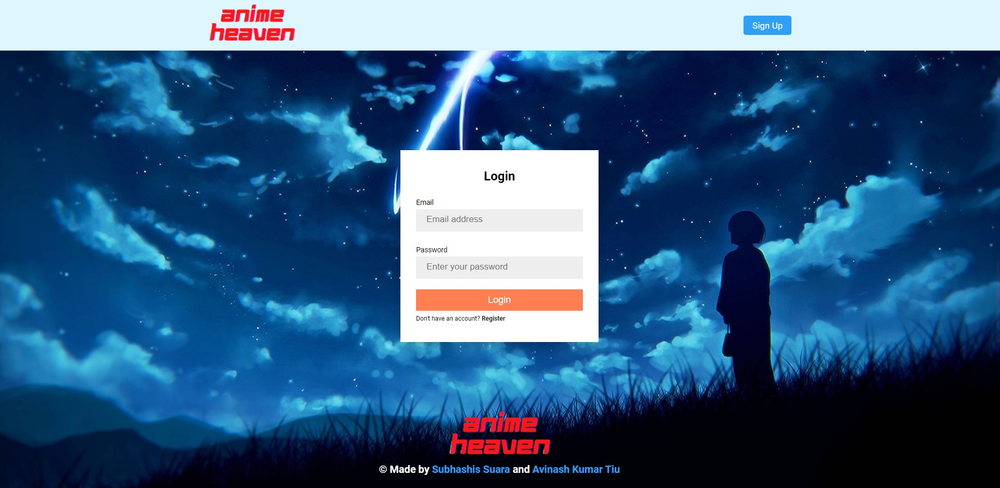
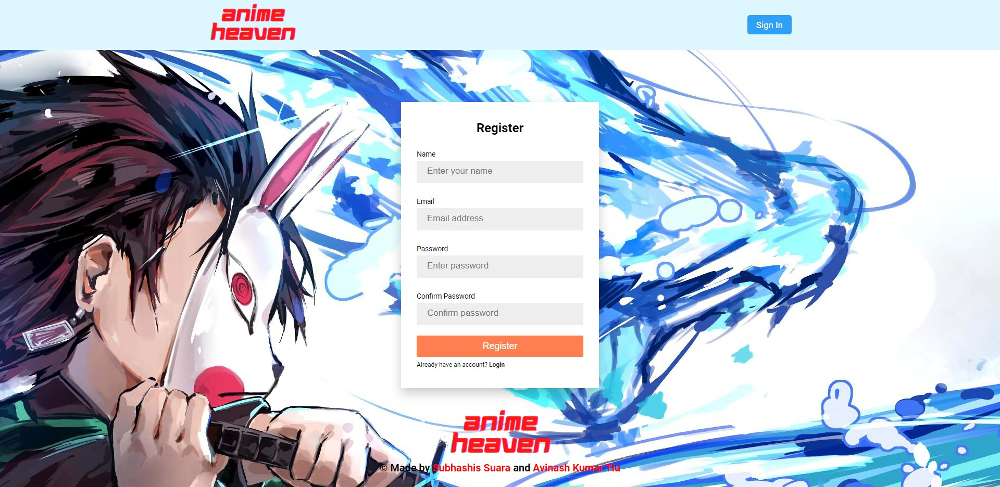
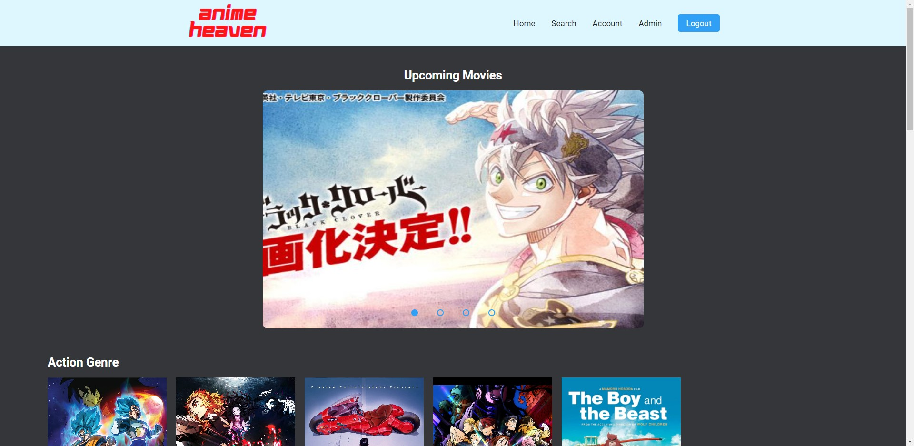
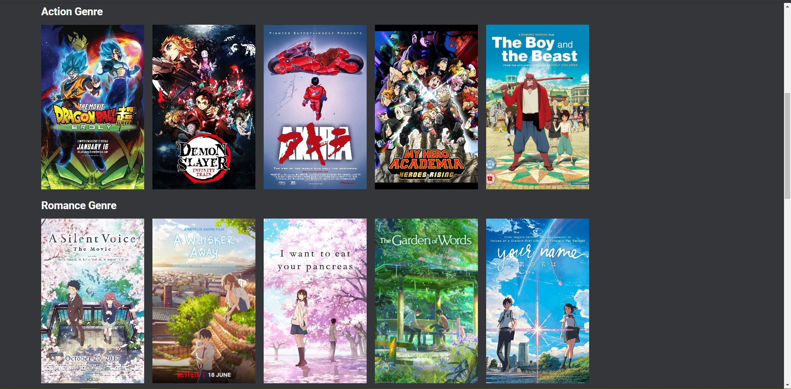
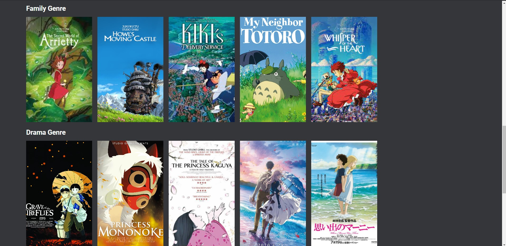
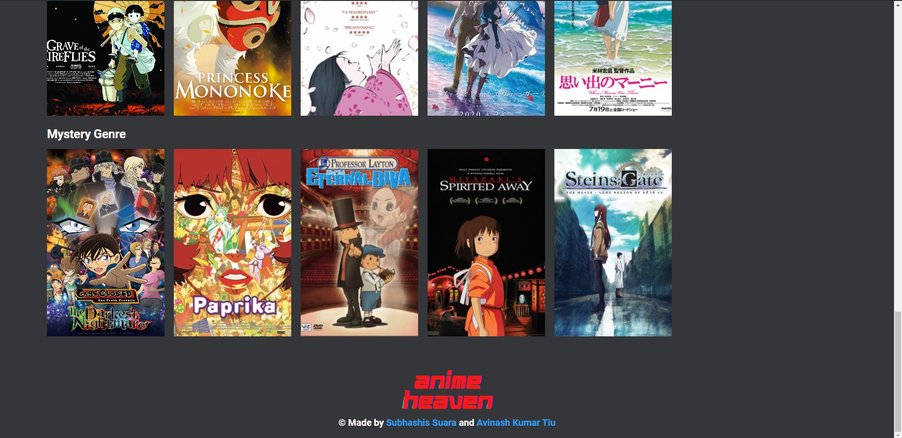
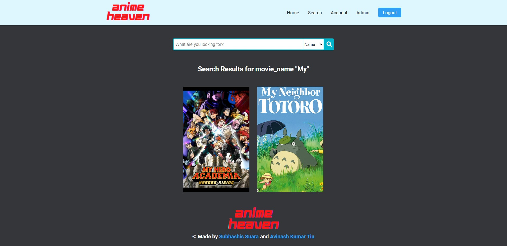
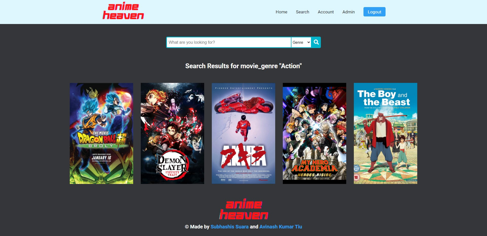
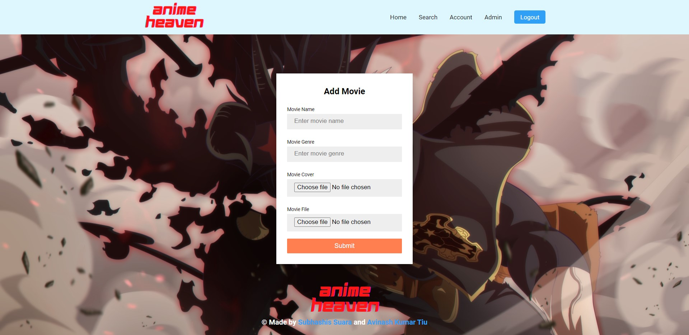
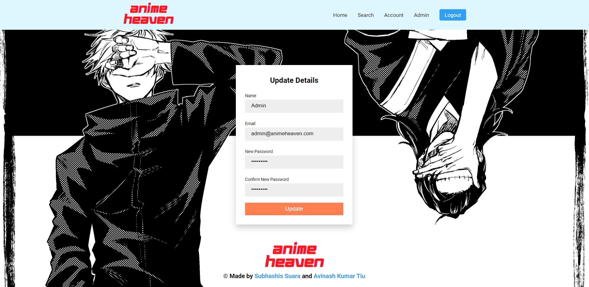

# Anime Heaven

An anime video streaming website made using HTML, CSS, JavaScript, PHP, MySQL.

Created by Subhashis Suara & Avinash Kumar Tiu.

# Features

- Search keywords to fetch results from database based on movie name or movie genre.
- Registration & login page.
- Account page, to change account details.
- Admin page, to add videos to the database (hidden from normal user accounts).
- Homepage with carousel of upcoming movies, rows of movies based on genre (data is dynamically fetched and displayed from database).
- Session detection to avoid unauthorized access.
- Full page HTML5 video player that plays movies based on id given in url query.

# How to Run

1. Install WAMP server.
2. Create a virtual host for AnimeHeaven.
3. In taskbar icons,
   - Left click on WAMP server icon
   - Expand the PHP menu and select php.ini
   - Search for `post_max_size` and `upload_max_filesize` and change their values to the largest file's size in your database (`50M` in our case)
4. Place the media accordingly in the project or import it from `Admin` page in the website.
5. Import `animeheaven.sql` in phpMyAdmin.
6. Enjoy!

# Screenshots

## Login Page

## Registration Page

## Home Page

## Search Page (Name)

## Search Page (Genre)

## Admin Page

## Account Page

## User Account

**Note:** The above screenshot is from a regular user account and there is no link or access to the admin page.
